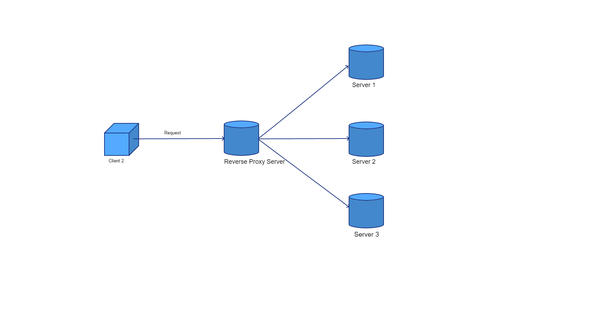

## Reverse Proxy

#### Proxy
Proxy is a web server which hides client identity whenever we try to access the server(example: google.com).
In Reverse Proxy client makes the request, but server doesn't know who is the client. Server essentially knows the proxy and sends the response to the proxy.
Proxy server knows the client and routes the content back to the client who requested it.

Benefits:
- Anonymity -> Server doesn't know who is the client.
- Caching -> Proxy can cache the static files from server. Problems : syncing.
- Blocking unwanted sites ->  Since all the traffic flows through proxy server, you can block specific websites from being accesses on the network.
- GeoFencing -> Clients can access certain servers. People from a particular area are not allowed to access server.

#### Reverse Proxy
Reverse proxy is a web server that centralizes internal servers and provides single interface to the client. Request will be routed to the available server of the many servers available. 

Benefits:
- Load Balancing is a special case of reverse proxy. It has to have two or more servers to balance the load.
- Caching -> Frequently accessed information can be accessed at the edge of the servers.
- Isolating Internal Traffic
- Logging -> Will contain information of all the requests and responses for a server.
- Canary Releases -> Few Servers behind reverse proxy server can serve canary versions of the your service and rest of the servers on stable release.
- SSL termination - Decrypt incoming requests and encrypt server responses so backend servers do not have to perform these potentially expensive operations
